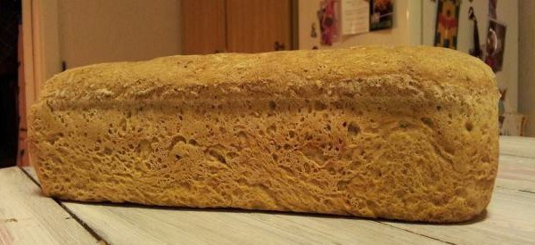

## Brødoppskrift (3 brød)

Hvorfor ikke bake brød selv? 

Det går rimelig raskt og greit å bake brød, i alle fall den tiden du faktisk gjør noe. Resten av tiden går jo til heving og steking, og da kan du gjøre noe annet. 

Jeg vil påstå at du ikke trenger å “kaste bort” mer enn 20 minutter på tre-fire brød. Jeg tar da utgangspunkt i at du memoriserer oppskriften i hodet og kan bare blande og mikse fortløpende uten å tenke deg om. 

Fordelen er at du alltid kan ha brød i fryseren som er like fersk når du tar de opp og de har lengre holdbarhet enn kjøpekneip. Også smaker de så mye bedre.

#### Ingredienser

* 1,2kg hvetemel
* 300g grov rug
* 300g grov hvete
* 25g salt
* 1pk tørrgjær
* litt kli eller lignende
* ca 1,2 liter lunket vann

#### Fremgangsmåte

1. Bland alt det tørre
2. Ha i oljen og vannet mens du rører om
3. Sett til forheving
4. Tøm deigen ut på bordet og del i tre-fire like deler og kna fort og effektivt og press de ned i ferdigsmurte former (her ersprayboks bra)
5. Hev brødene videre til de er 1-2cm over kanten på brødformene og sett meget forsiktig inn nederst i ovnen. Ovnen skal være forvarmet til 250 grader og senket til 180 grader når du setter brødene inn.
6. La de stå i ca 45 minutter, alt etter ovn, bedre for lenge enn for kort. Sleng gjerne bakepapir over (etter 30 minutter) hvis du er redd for svarte brød.
7. Ta ut brødformene og hvelv de på en rist til avkjøling. Når de er avkjølt kan du nyte ferskt brød og fryse resten.

Lykke til!
