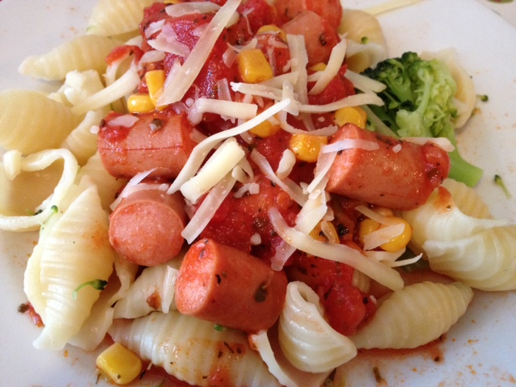

## Pølsebiter i tomatsaus og pasta

#### Ingredienser

* En boks hakkede tomater
* Halv bunt brokkoli
* 2-3 dl shellpasta
* 1 ts salt
* 1 ss oregano
* En pakke grillpølser
* En boks maiskorn
* Revet ost

#### Fremgangsmåte

Kok opp pastaen med litt salt og tilsett brokkolitrær mot slutten av kokingen. Kutt opp pølser og og stek i smør sammens med maiskorn. Tilsett en boks hakkede tomat og en spiseskje oregano. Rør og la det varme seg godt opp. Dryss litt revet ost på før servering.
